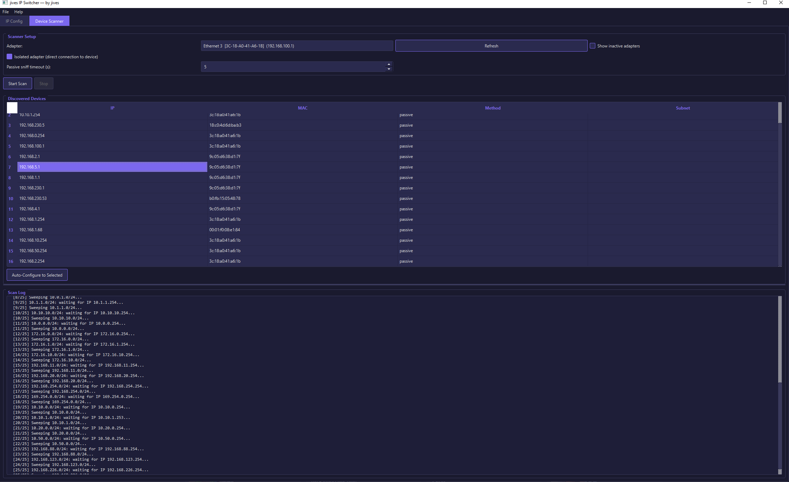
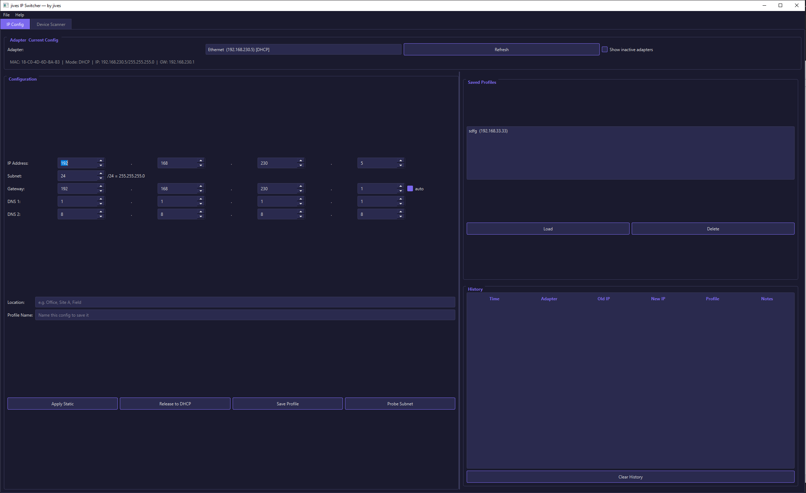

# jives IP Switcher — by jives

A Windows utility for managing network adapter IP configurations and finding
unknown devices on direct connections.





## Features

### IP Config Tab
- Set static IP on any network adapter
- "Release to DHCP" button for quick DHCP assignment
- Save and load named IP profiles (with optional location tag)
- History of all config changes (last 500)
- Backup of adapter config before every change
- QSpinBox inputs for all IP octets -- typing `.` advances to next octet
- Auto-focus on first octet on startup, ready for typing
- Auto-calculated gateway (network + 1) with toggle
- Default DNS: Cloudflare (1.1.1.1) + Google (8.8.8.8)
- Inactive adapters hidden by default ("Show inactive" checkbox)
- **Probe Subnet**: adds a temporary secondary IP, ARP-sweeps the /24,
  shows alive/free IPs, then removes the temp IP. Quick re-check before
  assigning to verify the IP is still free.

### Device Scanner Tab
For when you're directly plugged into a network and need to find devices:

- **Concurrent passive sniff + ARP sweep**: passive listens on the adapter
  the entire time the ARP sweep iterates 25 common engineering subnets
- **Builds a results table** like a normal scanner -- doesn't stop at first device
- **Real-time updates**: devices appear in the table as they're discovered
- Uses secondary IPs (doesn't touch primary) with DAD wait for each subnet
- **Npcap auto-restart**: if the adapter isn't visible to scapy (common with
  USB adapters plugged in after Npcap install), automatically restarts the
  Npcap driver to pick it up
- "Auto-Configure to Selected" sets your adapter to .2 on the device's subnet
- Stop button kills both passive sniff and ARP sweep immediately

### "Isolated adapter" mode
When checked (default), assumes you are directly connected to one device.
Any traffic seen is from that device. This enables faster detection because
we don't need to filter out noise from other devices.

## Requirements
- Windows 10 or 11
- Python 3.11+
- PySide6 (GUI)
- scapy + Npcap (device scanner + probe)
- **Run as Administrator** for IP changes to work (app auto-elevates via UAC)

## Install
```
pip install -r requirements.txt
```
Also install Npcap from https://npcap.com
(enable "WinPcap API-compatible mode" during install).

## Run
```
python src/main.py
```
Or use the built EXE (double-click, UAC prompt appears automatically).

## Architecture
Three-layer split (following the workbenchSetupTool retrospective):
- `src/discovery.py` — adapter enumeration, data classes, profile/history storage
- `src/operations.py` — netsh IP config, backups, device scanning, subnet probing
- `src/main.py` — PySide6 GUI, QThread workers, UAC auto-elevation

## Tests
```
pytest tests/
```

## License
MIT

## Author
jives — [github.com/jonives](https://github.com/jonives)